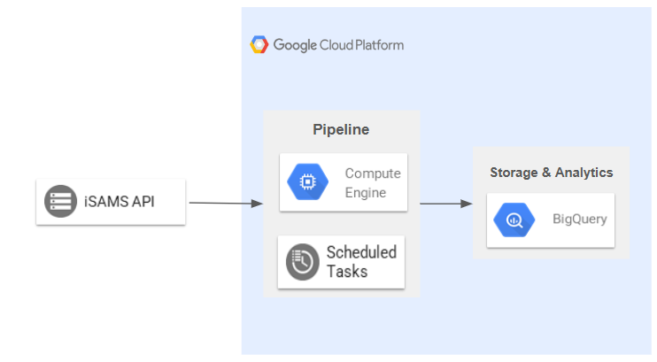

# isams_pipeline

A demonstration on building a data pipeline that moves data from iSAMS API endpoints to BigQuery.

## High-level Architecture



**Explanation:**
1. A scheduler in the Compute Engine Instance triggers `iSAMS.py`.
2. The script pulls OAuth2 creds from Secret Manager.
3. The script sends HTTP requests to iSAMS API endpoints and receives data payloads in the form of JSON strings.
4. The payloads are processed with Python and loaded to BigQuery.
5. You can further model the data in BigQuery.

---

## Set Up

### Prerequisites

1. GCP project with BigQuery and Secret Manager enabled
2. iSAMS API OAuth2 client credentials:
	- client ID
	- client secret
3. iSAMS API endpoints:
	- base URL
        - endpoint URLs
4. Service account with BigQuery + Secret Manager access
5. Python 3.11+

### Store OAuth2 Credentials in Secret Manager

1. This project retrieves OAuth2 client credentials from [Secret Manager](https://cloud.google.com/secret-manager) using the secret ID `isams_api_credentials`. Store the credentials as a JSON payload:

	- Store as `oauth_credentials.json`
	```json
	{
		"CLIENT_ID": "your-client-id",
		"CLIENT_SECRET": "your-client-secret",
		"TOKEN_URL": "https://example.com/oauth/token",
		"API_BASE_URL": "https://example.com/api"
	}
	```

2. Create the secret (or add a new version) using the `gcloud` CLI:

	```bash
	# create the secret from the JSON file
	gcloud secrets create isams_api_credentials --data-file=oauth_credentials.json

	# or, add a new version to an existing secret
	gcloud secrets versions add isams_api_credentials --data-file=oauth_credentials.json
	```

3. Give your service account the `roles/secretmanager.secretAccessor` role so the script can receive the payload using service account credentials.

### Python Dependencies

1. Create and activate a Python virtual environment (venv) to install dependencies.

	```bash
	python3 -m venv myvenv
	source myvenv/bin/activate
	```

2. Install the dependencies.
	```bash
	pip install --upgrade dask pandas pandas-gbq numpy openpyxl xlsxwriter xlrd db-dtypes SQLAlchemy
	pip install --upgrade google-api-python-client pydrive
	pip install --upgrade google-cloud-bigquery google-cloud-storage google-cloud-bigquery-storage
	pip install --upgrade google-cloud-secret-manager google-auth google-auth-oauthlib google-auth-httplib2
	pip install --upgrade colorama
	```
---

## Execution

### Credentials Configuration

1. Include service account credentials: modify this part in `iSAMS.py`:
	- `KEY_PATH`: path to the directory that contains your service account key.
	- `KEY_NAME`: name of the service account key.
    - This setup allows you to store and use multiple keys.
	```python
	# Service Account Credentials
	KEY_PATH = "Path to folder containing Service Account Keys"
	KEY_NAME = 'Service Account JSON key file'
	SERVICE_ACC_KEY = f'{KEY_PATH}/{KEY_NAME}'
	```

2. Create a service account credentials object. This allows you to access resources the service account is granted permission to.
	```py
	# retrieve Service Account credentials
	service_acc_creds = service_account.Credentials.from_service_account_file(SERVICE_ACC_KEY)
	```

3. Retrieve OAuth2 client credentials from Secret Manager. This allows the script to send HTTP requests to iSAMS API endpoints.
	```py
	# retrieve Service Account credentials
	service_acc_creds = service_account.Credentials.from_service_account_file(SERVICE_ACC_KEY)

	# retrieve OAuth2 client credentials from Secret Manager
	SECRET_ID = "isams_api_credentials"
	secret_payload = get_secret(SECRET_ID, service_acc_creds.project_id, service_acc_creds)

	# Set OAuth2 client credentials
	CLIENT_ID = secret_payload["CLIENT_ID"]
	CLIENT_SECRET = secret_payload["CLIENT_SECRET"]
	TOKEN_URL = secret_payload["TOKEN_URL"]
	API_BASE_URL = secret_payload["API_BASE_URL"]
	```

4. Build a BigQuery client object to allow your script to communicate with BigQuery.
	```py
	# build BigQuery API Client
	bq_client = bq.Client(credentials=service_acc_creds, project=service_acc_creds.project_id)
	```

### Pipeline Configuration

1. Add the pipeline data to the `isams_dataset_endpoints` dictionary in `python_utils/formats.py`:
	- key: The name of the endpoint.
	- values:
		- `url`: The endpoint URL.
		- `object`: The object containing data to be extracted from the JSON payload received from the HTTP request.
		- `pages`: Use `'single-page'` if the API endpoint only contains one page of data and `'multi-page'` if it contains multiple pages of data. Multi-page endpoints will usually be able to accept parameters such as `{'page': 1, 'pageSize': 1}`.
		- `table_id`: The table ID of the table to load the data to in BigQuery.
		- `schema`: Schema definition for the data to be uploaded. This hard-sets the data type of the uploaded data.

	**Endpoint data:**

	```py
	isams_dataset_endpoints = {
		'students': {
			'url': '/api/students',
			'object': 'students',
			'pages': 'multi-page',
			'table_id': 'project_id.dataset.students',
			'schema': students_schema,
		},
		
		'school_terms': {
			'url': '/api/school/terms',
			'object': 'terms',
			'pages': 'single-page',
			'table_id': 'project_id.dataset.school_terms',
			'schema': school_terms_schema
		},
		
		'year_groups' : {
			'url': '/api/school/yeargroups',
			'object': 'yearGroups',
			'pages': 'single-page',
			'table_id': 'project_id.dataset.year_groups',
			'schema': year_groups_schema
		}
	}

	```

	**Schema definition:**
	```py
	school_terms_schema = [
		bq.SchemaField("id", "INTEGER", mode="NULLABLE"),
		bq.SchemaField("finishDate", "DATETIME", mode="NULLABLE"),
		bq.SchemaField("name", "STRING", mode="NULLABLE"),
		bq.SchemaField("schoolYear", "INTEGER", mode="NULLABLE"),
		bq.SchemaField("startDate", "DATETIME", mode="NULLABLE"),
	]
	```

2. Add a function to modify the data received from the endpoint in `python_utils/modify_cols.py`. For example, you want to modify the date format of certain columns in the `school_terms` endpoint:
	```py
	import pandas as pd

	TIMEZONE = 'Asia/Singapore'

	def parse_datetime_utc8(date_col:pd.Series) -> pd.Series:
		date_col = pd.to_datetime(date_col, utc=True, errors="coerce")
		return date_col.dt.tz_convert(TIMEZONE)
	def school_terms_mod(terms_df:pd.DataFrame):
		date_cols = ['finishDate', 'startDate']

		for date_col in date_cols:
			terms_df[date_col] = parse_datetime_utc8(terms_df[date_col])

		return terms_df
	```

3. In `iSAMS.py`, add the modification function to `mod_endpoints()`.
	```py
	def mod_endpoints(endpoint, df:pd.DataFrame):
		match endpoint:
			case 'school_terms':
				return school_terms_mod(df)
		
		return df
	```

4. In `main()`, there is an if condition that allows you to selectively process endpoints:
	```py
	# selectively run endpoints:
	if endpoint not in []:
		continue
	```

	Simply add the name of the endpoint you want to process to the list:
	```py
		# selectively run endpoints:
		if endpoint not in ['students']:
			continue
	```

	The other endpoints will be skipped.

### Script Logic

You have finished the configuration for the main process. This is what happens when you execute the script:

1. The script iterates through each endpoint and processes them according to their `page` type as defined in `python_utils/formats.py`.
        - `'single-page'` endpoints will trigger `single_page_endpoint()` function and have their data received and loaded in one go.
        - `'multi-page'` endpoints will trigger `multi_page_endpoint()` function which processes and loads data every 1,000 rows as it needs to go through multiple pages.
        - Both functions have the option to append to or truncate the target BigQuery table. Use append mode by setting `trunc_flag` to `True` and truncate mode by setting `trunc_flag` to `False`.

2. When `single_page_endpoint()` or `multi_page_endpoint()` is called, it calls `mod_endpoints()` in `python_utils/modify_cols.py` to modify the data for specific endpoints.

---

## Scheduling

### Job Script: `isams_pipeline.sh`

1. `isams_pipeline.sh` assumes the script is stored in `/home/isams_pipeline/`. If you use a different directory, change the working directory here:
	```bash
	# Main pipeline execution
	{
		echo "===== START: $(date) ====="
		cd /home/isams_pipeline/ || exit 1
		source myvenv/bin/activate
		cd /home/isams_pipeline/ || exit 1
		python iSAMS.py 2>&1
		echo "===== END: $(date) ====="
	} | tee -a "$LOG_FILE"
	```

2. `isams_pipeline.sh` is used to:
	- trigger the Python script
	- handle logging
	- intercept error messages and failed executions

3. Logging Logic:
	- Truncate `/var/log/isams_pipeline.log` to clear previous logs.
	- Write logs to `/var/log/isams_pipeline.log`.
	- Create a copy of `/var/log/isams_pipeline.log` with a timestamp (`/var/log/isams_pipeline_TIMESTAMP.log`).
	- Save the log file in an archive folder `/var/log/isams_pipeline_arch`.
	- This happens during every execution.

### Cron Scheduler

Schedule a trigger for `isams_pipeline.sh`.

```bash
00 06 * * * sudo bash /home/isams_pipeline/isams_pipeline.sh
```

---

## Custom Pipelines

### Introduction
- `custom.py` allows you to add custom functions to process certain endpoints.
`- custom.py` already includes an example: `year_group_division` and a `custom_pipelines()` hook.

### Steps

1. Define your custom functions for processing endpoints in `custom.py`.
2. Add the function call to `custom_pipelines()`.
3. Call `custom_pipelines()` in your `main()` function in `iSAMS.py`.

---

## Improvements

Once you have finished your pipeline configurations, consider dockerising the script and use Cron or any other scheduler to run the docker image.
This makes the pipeline easier to manage.
